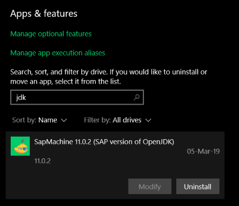

# SapMachine Windows Installer

[](https://travis-ci.org/Cyclenerd/SapMachineInstaller)

[SapMachine](https://github.com/SAP/SapMachine) is a downstream version of the OpenJDK project.
It is used to build and maintain a SAP supported version of OpenJDK for SAP customers and partners who wish to use OpenJDK to run their applications.

SAP currently doesn't provide an installer for Windows. Therefore this project.

This installer is created with [NSIS](https://nsis.sourceforge.io) (Nullsoft Scriptable Install System).
It is a professional open source system to create Windows installers.

This installer performs the following steps:

* Install SapMachine version to selected installation directory
* Optional set JAVA_HOME and update PATH system environment variables

## Install

### GUI

Run `sapmachine.exe` with Windows administrator rights.
The installer `sapmachine.exe` is in this docu a placeholder for the actual installer such as  `sapmachine-jdk-11.0.2_windows-x64_bin.exe`.


### Silent

```
sapmachine.exe /S
```

Change the default installation directory:

```
sapmachine.exe /S /D=C:\Program Files\JDK
```

## Uninstall

### GUI

Run `uninstall.exe` from selected installation directory or uninstall via the Settings menu.



### Silent

```
uninstall.exe /S
```

## Build Installer

Download and install NSIS: https://nsis.sourceforge.io/Download

Download SapMachine release: https://sap.github.io/SapMachine/

Unzip:

```
7z.exe x sapmachine-jdk-11.0.2_windows-x64_bin.zip
```
Rename to `sapmachine` and check folder structure:

```
move sapmachine-11.0.2 sapmachine

dir sapmachine

16-Jan-19  14:51    <DIR>          .
16-Jan-19  14:51    <DIR>          ..
16-Jan-19  14:51    <DIR>          bin
16-Jan-19  14:51    <DIR>          conf
16-Jan-19  14:51    <DIR>          include
16-Jan-19  14:51    <DIR>          jmods
16-Jan-19  14:51    <DIR>          legal
16-Jan-19  14:51    <DIR>          lib
16-Jan-19  14:50             1,228 release
               1 File(s)          1,228 bytes
               8 Dir(s)  565,306,568,704 bytes free
```

Run the following command:

```
makensis.exe /V4 /DVERSION=<major version> /DFULLVERSION=<full version> sapmachine.nsi
```

Example for Version 11.0.2

```
makensis.exe /V4 /DVERSION=11 /DFULLVERSION=11.0.2 sapmachine.nsi
move sapmachine.exe sapmachine-jdk-11.0.2_windows-x64_bin.exe
```

## License

This installer is Open Source Software and under the same licensing terms as the upstream OpenJDK project.
